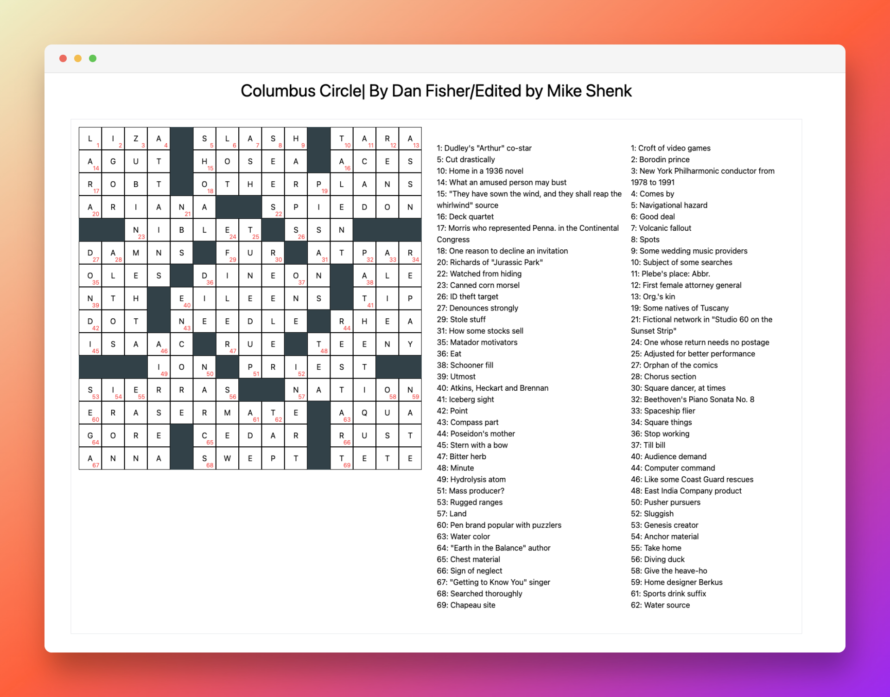

#### This is my attempt to the coding test.

#### I have used PHP 8.1, although I have not used many of the new features.

#### For production code I would have improved the code further, but I wanted to keep it simple for this test.

I've found on thisurl [thesun](https://feeds.thesun.co.uk/puzzles/crossword/20221019/51884/) and used it as guideline for the test.



#### How to run the code

```bash
#from the php-02 folder
php -S localhost:8000
```
